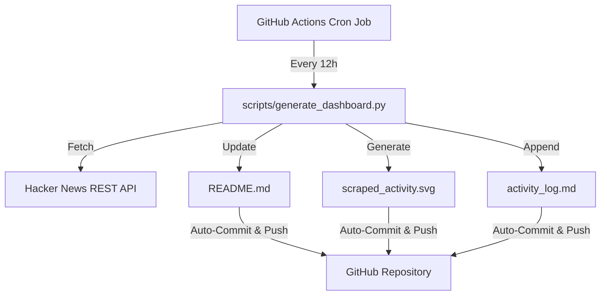

# 👋 Vivek Rana

**AI/ML Engineer & Data Engineer** | Specializing in Computer Vision, Deep Learning, and High-Throughput Data Engineering.

---

## ⚡ Engineering Impact in Numbers

*   🚗 **Computer Vision:** YOLOv8-based vehicle tracking and counting suite operating at **95% accuracy** and **34 FPS**.
*   📈 **Predictive Modeling:** Advanced ML forecasting engines achieving **0.92+ ROC-AUC** on cricket match outcomes and stock trends.
*   ⚡ **Data Pipelines:** Production-grade concurrent scraping architectures processing millions of SKU listings with robust anti-bot bypass.

---

## 🛠️ Technology Stack

| Category | Technologies |
| :--- | :--- |
| **AI/ML & Computer Vision** | `Python` `PyTorch` `TensorFlow` `OpenCV` `Ultralytics YOLOv8` `LangChain` `FAISS` |
| **Data & Crawling** | `Pandas` `NumPy` `Playwright` `Scrapy` `BeautifulSoup4` `MySQL` `PostgreSQL` |
| **Backend & DevOps** | `FastAPI` `Streamlit` `Uvicorn` `Docker` `Docker Compose` `Git` `GitHub Actions` |

---

## 🤖 Pinned Projects & Engineering Showcase

### 1️⃣ [YOLOv8 Traffic Object Detection & Analytics Suite](https://github.com/vivekrana-031122/yolo-traffic-monitor)
*Real-time object detection and diagnostic toolkit built to analyze traffic density, count vehicle classes, and track diagnostics.*
*   **Key Stats:** **95% tracking accuracy** / **34 FPS** execution speed.
*   **Highlight:** Features a custom GUI label reviewer (`label_reviewer.py`) for dataset annotation correction and model diagnostic metrics tracking.
*   **Stack:** Python, Ultralytics YOLOv8, OpenCV, PyTorch, Streamlit

### 2️⃣ [AI Teaching Coach ("Agent 1")](https://github.com/vivekrana-031122/ai-teaching-coach)
*Bilingual web-based study peer tutor designed to explain complex engineering codebases and log summaries.*
*   **Highlight:** Integrates Google Gemini API to translate dry repository files into fluid **Hinglish** explanations, with active-recall prompts and line-by-line concept breakdown.
*   **Stack:** FastAPI, HTML5/CSS3/JavaScript (glassmorphism UI), Google Gemini API, Docker

### 3️⃣ [Retail E-commerce Scraper & Import Pipeline](https://github.com/vivekrana-031122/scraper-retail-import-pipeline)
*Enterprise-grade configuration-driven import pipeline and scraper suite for large-scale retail catalog data ingestion.*
*   **Highlight:** Features multi-threaded Playwright Stealth crawlers for Amazon and Flipkart, parsing product weights and pricing with an automated QA validation engine mapping categories.
*   **Stack:** Playwright, BeautifulSoup4, Pandas, openpyxl, MySQL, Dotenv

### 4️⃣ [Secure RAG PDF Chatbot](https://github.com/vivekrana-031122/RAG-PDF-CHATBOT)
*A multi-tenant Retrieval-Augmented Generation chatbot with FastAPI endpoints and Streamlit frontend.*
*   **Highlight:** Dual UI/API interfaces with secure UUID-validated document session storage, disk persistence for FAISS vectors, and containerized Docker-Compose configuration.
*   **Stack:** FastAPI, Streamlit, LangChain, FAISS vector store, Docker Compose

---

## 📈 GitHub Metrics & Top Languages

  

---

## ⚙️ Automated Engineering Pipeline (Self-Updating Profile)

This repository runs a scheduled GitHub Action that aggregates trending tech headlines and outputs scraper diagnostics.

---

<!-- DASHBOARD_START -->

### 📊 Live Scraper Dashboard (Auto-updates every 12h)
This section is automatically updated by a **GitHub Actions runner** that executes a custom Python scraper to pull trending articles from public endpoints.

#### 📰 Trending Tech Headlines (Scraped from Hacker News)
| Headline | Score | Scraped By |
| :--- | :---: | :---: |
| [libexpat now funded by the City of Munich for up to 6 months](https://blog.hartwork.org/posts/libexpat-city-of-munich-open-source-sabbatical/) | `170 pts` | `@spyc` |
| [Eight Myths on Software Engineering and GenAI](https://queue.acm.org/detail.cfm?id=3807963) | `100 pts` | `@tchalla` |
| [Pi's Minimalism Is Its Advantage](https://earendil.com/posts/pi-autoresearch-and-databricks/) | `149 pts` | `@luispa` |
| [Mistral's Shieldstral: 3B open-weights model for multimodal moderation](https://mistral.ai/news/shieldstral/) | `329 pts` | `@riadsila` |
| [IP and DNS Leaks in WebKit Affecting Proxy Browsers and iCloud Private Relay](https://mysk.blog/2026/08/04/webkit-proxy-icloud-private-relay-ip-leak/) | `53 pts` | `@lapcat` |

  

*Last automated pipeline execution: `2026-08-05 03:22:20 UTC`*
<!-- DASHBOARD_END -->

---

## 📨 Connect With Me

*   **LinkedIn:** [linkedin.com/in/vivek-rana-2899b8292](https://linkedin.com/in/vivek-rana-2899b8292)
*   **Email:** [vivekrana.031122@gmail.com](mailto:vivekrana.031122@gmail.com)
