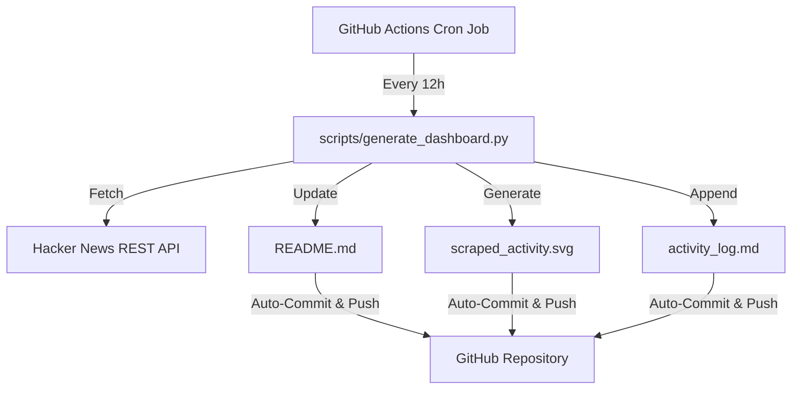
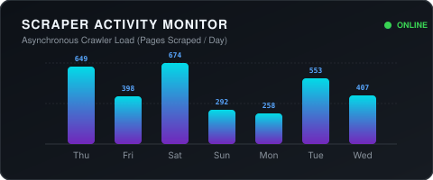

# 👋 Vivek Rana

**AI/ML Engineer & Backend Developer** | Building Production-Grade Intelligent Systems, RAG Pipelines & Agentic Workflows

[](https://linkedin.com/in/vivek-rana-2899b8292)
[](https://github.com/vivekrana-031122)

---

## 🚀 About Me

I am a Python developer and AI engineer passionate about developing **scalable, secure, and production-ready intelligent systems**. Currently working as a **Data Analyst Intern at Trailytics**, where I apply data manipulation, SQL optimization, and automated scripting to real-world datasets.

*   **🔭 Currently Working On:** Building multi-tenant RAG systems with local vector database persistence.
*   **🧠 Specializing In:** Large Language Model (LLM) orchestration, vector search architectures, and concurrent process scheduling.
*   **🌱 Learning Next:** Next.js (App Router), TypeScript, and pgvector for native SQL vector indexes.

---

## 🏆 Featured Repositories

### 1️⃣ [Secure RAG PDF Chatbot](https://github.com/vivekrana-031122/RAG-PDF-CHATBOT)
*A secure, persistent Retrieval-Augmented Generation service with dual Streamlit UI & FastAPI REST interfaces.*

*   **Core Stack:** FastAPI, Streamlit, LangChain, OpenAI, FAISS, Docker Compose.
*   **Key Engineering Updates:**
    *   🔒 **UUID Validation:** Input validation check on all database session paths to prevent directory traversal exploits.
    *   💾 **Disk Persistence:** Automatic disk serialization for both index vectors and conversation history sessions.
    *   🐳 **Containerized Deployment:** Dockerized multi-service configuration for instantaneous local spins.

---

## 🕷️ Professional Web Scraping & Data Extraction Portfolio

A collection of production-grade web crawlers, quick commerce scrapers, and data extraction engines showcasing advanced parsing, anti-bot bypass strategies (headers/cookies/playwright-stealth), and database persistence (SQLite/MySQL).

| Repository Name | Description | Key Tech Stack | Link |
| :--- | :--- | :--- | :--- |
| [`scraper-zepto-pdp`](https://github.com/vivekrana-031122/scraper-zepto-pdp) | Scrapy-based Zepto product detail page scraper | Scrapy, PyMySQL, SQLite | [View Repository](https://github.com/vivekrana-031122/scraper-zepto-pdp) |
| [`scraper-myntra-pincode`](https://github.com/vivekrana-031122/scraper-myntra-pincode) | Geographically localized Myntra product price & stock crawler | Scrapy, Cloudscraper, SQLite | [View Repository](https://github.com/vivekrana-031122/scraper-myntra-pincode) |
| [`scraper-flipkart-minutes`](https://github.com/vivekrana-031122/scraper-flipkart-minutes) | Playwright Stealth scraper for Flipkart Minutes brands | Playwright, BeautifulSoup4 | [View Repository](https://github.com/vivekrana-031122/scraper-flipkart-minutes) |
| [`scraper-swiggy-instamart`](https://github.com/vivekrana-031122/scraper-swiggy-instamart) | Search-engine fallback Swiggy Instamart image resolver | Playwright, BeautifulSoup4 | [View Repository](https://github.com/vivekrana-031122/scraper-swiggy-instamart) |
| [`scraper-1mg-reviews`](https://github.com/vivekrana-031122/scraper-1mg-reviews) | Concurrent HTTPX crawler with Semaphore rate limiting | HTTPX, Asyncio | [View Repository](https://github.com/vivekrana-031122/scraper-1mg-reviews) |
| [`scraper-healthcare-products`](https://github.com/vivekrana-031122/scraper-healthcare-products) | Medicine catalog crawler (Tata 1mg, Apollo, PharmEasy) | HTTPX, Pandas | [View Repository](https://github.com/vivekrana-031122/scraper-healthcare-products) |
| [`scraper-ecommerce-keywords`](https://github.com/vivekrana-031122/scraper-ecommerce-keywords) | Search term visibility tracker (Amazon, Noon, BigBasket) | Playwright, Requests | [View Repository](https://github.com/vivekrana-031122/scraper-ecommerce-keywords) |
| [`scraper-nykaa-brands`](https://github.com/vivekrana-031122/scraper-nykaa-brands) | Selenium crawler with SQLite caching and Excel exports | Selenium, SQLite, openpyxl | [View Repository](https://github.com/vivekrana-031122/scraper-nykaa-brands) |
| [`scraper-retail-pdp`](https://github.com/vivekrana-031122/scraper-retail-pdp) | Parallel catalog scraper for Amazon & Flipkart with Captcha resolver | Scrapy, Requests, SQLite | [View Repository](https://github.com/vivekrana-031122/scraper-retail-pdp) |

---

## 🤖 Machine Learning, AI & Data Engineering Portfolio

Engineering applications highlighting core artificial intelligence integrations, Retrieval-Augmented Generation (RAG) endpoints, and data processing utilities.

| Repository Name | Description | Key Tech Stack | Link |
| :--- | :--- | :--- | :--- |
| [`ai-teaching-coach`](https://github.com/vivekrana-031122/ai-teaching-coach) | Personal Bilingual Teaching Coach ("Agent 1") powered by Gemini API | FastAPI, HTML/CSS/JS, Google Gemini API | [View Repository](https://github.com/vivekrana-031122/ai-teaching-coach) |
| [`rag-pdf-chatbot`](https://github.com/vivekrana-031122/rag-pdf-chatbot) | Secure FastAPI/Streamlit RAG PDF chatbot with FAISS persistence | FastAPI, Streamlit, LangChain, FAISS | [View Repository](https://github.com/vivekrana-031122/rag-pdf-chatbot) |
| [`yolo-traffic-monitor`](https://github.com/vivekrana-031122/yolo-traffic-monitor) | YOLOv8 real-time vehicle detection and dashboard diagnostics | Ultralytics YOLO, OpenCV, Streamlit | [View Repository](https://github.com/vivekrana-031122/yolo-traffic-monitor) |
| [`ml-prediction-models`](https://github.com/vivekrana-031122/ml-prediction-models) | ML forecasting engines for IPL cricket matches & stock price trends | scikit-learn, pandas, numpy | [View Repository](https://github.com/vivekrana-031122/ml-prediction-models) |
| [`scraper-agency-data-uploaders`](https://github.com/vivekrana-031122/scraper-agency-data-uploaders) | Dynamic Excel-to-MySQL database ingestion pipeline | pandas, PyMySQL, SQLAlchemy | [View Repository](https://github.com/vivekrana-031122/scraper-agency-data-uploaders) |
| [`student-assignments`](https://github.com/vivekrana-031122/student-assignments) | Academic computational algorithms and python programming lab work | Python | [View Repository](https://github.com/vivekrana-031122/student-assignments) |

---

## 🛠️ Technical Skill Matrix

```
┌─────────────────────────────────┬─────────────────────────────────┐
│ Languages & Frameworks          │ AI & Database Systems           │
├─────────────────────────────────┼─────────────────────────────────┤
│ 🐍 Python (FastAPI, Streamlit)  │ 🤖 LLM Chains (LangChain)       │
│ ☕ Java (Core Basics)           │ 🧠 Vector DBs (FAISS, Pinecone) │
│ 📊 SQL (MySQL, PostgreSQL)      │ 📈 Analytics (Pandas, NumPy)    │
└─────────────────────────────────┴─────────────────────────────────┘
┌─────────────────────────────────┐
│ Developer Tools & DevOps        │
├─────────────────────────────────┤
│ 🐳 Docker & Docker Compose      │
│ ⚙️ Version Control (Git, GitHub) │
│ 🐧 OS Shells (Bash, PowerShell) │
└─────────────────────────────────┘
```

---

## 📈 Activity & Stats


---

## ⚙️ Automated Engineering Pipeline (Self-Updating Profile)

This repository is powered by a fully automated Python scraper and visualization engine.

### 🛠️ Architecture & How It Works


1. **GitHub Actions Workflow:** [profile_dashboard.yml](file:///.github/workflows/profile_dashboard.yml) triggers on a cron schedule.
2. **Python Scraper Engine:** [generate_dashboard.py](file:///scripts/generate_dashboard.py) uses only Python standard libraries to fetch trending tech stories without external dependencies.
3. **SVG Visualizer:** Generates a custom-styled SVG representing daily crawler loads with modern gradients.
4. **Log Verification:** Records execution metrics in [activity_log.md](file:///activity_log.md) to demonstrate automated proof of work.

---

<!-- DASHBOARD_START -->

### 📊 Live Scraper Dashboard (Auto-updates every 12h)
This section is automatically updated by a **GitHub Actions runner** that executes a custom Python scraper to pull trending articles from public endpoints.

#### 📰 Trending Tech Headlines (Scraped from Hacker News)
| Headline | Score | Scraped By |
| :--- | :---: | :---: |
| [DeepSeek V4 Flash 0731 Intelligence, Performance and Price Analysis](https://artificialanalysis.ai/models/deepseek-v4-flash-ga) | `239 pts` | `@theanonymousone` |
| [Google fixed more Chrome bugs in June than over the past two years, thanks to AI](https://blog.google/security/chrome-stronger-with-every-update/) | `259 pts` | `@Garbage` |
| [The session you cannot take with you](https://earendil.com/posts/session-portability/) | `570 pts` | `@apitman` |
| [JEP 401: Value Objects (Preview) merged to OpenJDK master](https://github.com/openjdk/jdk/pull/31120) | `179 pts` | `@mfiguiere` |
| [Situational Awareness Down 67% in July in AI Stock Rout](https://www.wsj.com/finance/investing/situational-awareness-down-67-in-july-in-ai-stock-rout-cd19901f) | `50 pts` | `@pondsider` |

<p align="center">
  
</p>

*Last automated pipeline execution: `2026-07-31 14:26:38 UTC`*
<!-- DASHBOARD_END -->

---

## 📨 Connect With Me
*   **LinkedIn:** [linkedin.com/in/vivek-rana-2899b8292](https://linkedin.com/in/vivek-rana-2899b8292)
*   **GitHub:** [github.com/vivekrana-031122](https://github.com/vivekrana-031122)
*   **Email:** [vivekrana.031122@gmail.com](mailto:vivekrana.031122@gmail.com)
